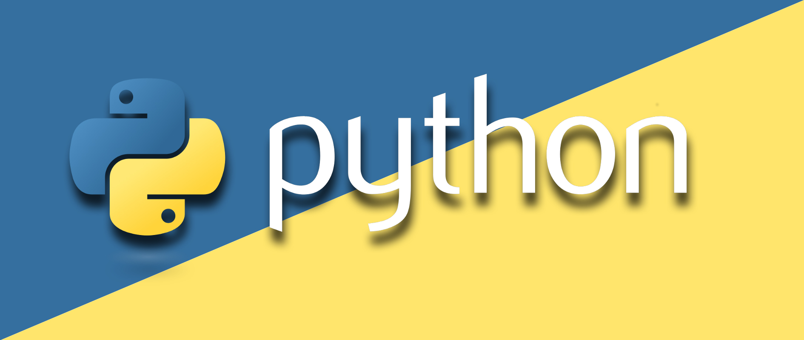

# Programming Fundamentals 
09090016 พื้นฐานการเขียนโปรแกรม

ผู้สอน: อ.อัคเรศ สิงห์ทา


## ปีการศึกษา 2567/1
รายวิชานี้ดำเนินการสอนในรูปแบบการบรรยาย ปฏิบัติการทางคอมพิวเตอร์ 
อาจรวมถึงห้องเรียนออนไลน์หรือเป็นไปตามประกาศของทางมหาวิทยาลัยเทคโนโลยีราชมงคลธัญบุรี 

ห้องเรียนออนไลน์ Microsoft Teams

| Section | Invitation Code | 
|---------|-----------------|
|     01  |   `3zf1god`     | 

กรุณากรอกรหัสการเข้าร่วมเพื่อเข้าใช้ห้องเรียนออนไลน์

## เวลาและสถานที่เรียน

| Section | ห้องเรียน | วัน | บรรยายทฤษฏี  | ปฏิบัติการ  |
|--------|---------|----|---------------|---------------|
| 01     |  ST1905 | จันทร์ | 13.00 - 14.00  | 14.00 - 17.00|

สอบกลางภาค: 29 สิงหาคม 2566 เวลา 09.00 - 12.00 @TBA

สอบปลายภาค: 24 ตุลาคม 2566 เวลา 09.00 - 12.00 @TBA


## คำอธิบายรายวิชา
ขั้นตอนการแก้ปัญหา หลักการทั่วไปเกี่ยวกับการเขียนโปรแกรม องค์ประกอบของประโยคคำสั่ง เช่น ตัวแปร ค่าคงที่ เครื่องหมายกระทำการ นิพจน์ ฟังก์ชัน เป็นต้น ชนิดของข้อมูลแบบต่าง ๆ โครงสร้างข้อมูลแบบอาร์เรย์ โครงสร้างคำสั่งแบบตามลำดับ เลือกทำ และ การวนซ้ำ การเรียกใช้โปรแกรมย่อย การสร้างโปรแกรมย่อย การส่งผ่านค่าภายในโปรแกรม การบันทึกและอ่านข้อมูลจากแฟ้มข้อมูล การตรวจสอบ ทดสอบและแก้ไขโปรแกรม และการใช้เครื่องมือในการพัฒนาโปรแกรม

Algorithmic problem solving, general concepts for computer programming, components of a statement such as variables, constants, operators, expressions, functions, various types of data, structured data types of array, program structures of sequence, selections and repetitions, subroutine calls, program modules, parameter passing, sequential and random access file operation, testing and debugging, using of tools for program development


## จุดมุ่งหมายรายวิชา

1. อธิบายหลักการการเขียนโปรแกรมด้วยภาษาโปรแกรมได้อย่างน้อยหนึ่งภาษา 
2. เลือกขั้นตอนการแก้ปัญหาโดยการใช้อัลกอริทึมในการหาผลเฉลยได้อย่างเหมาะสม 
3. จำแนกประเภทของข้อมูลตามหลักภาษาโปรแกรมได้อย่างน้อยหนึ่งภาษา 
4. จำแนกองค์ประกอบของประโยคคำสั่งตามหลักภาษาโปรแกรมได้อย่างน้อยหนึ่งภาษา 
5. เขียนโปรแกรมโดยใช้องค์ประกอบของประโยคคำสั่งตามหลักภาษาโปรแกรมได้อย่างน้อยหนึ่งภาษา 
6. เขียนโปรแกรมโดยใช้โครงสร้างข้อมูลแบบอาเรย์ด้วยภาษาโปรแกรมได้อย่างน้อยหนึ่งภาษา 
7. เขียนโปรแกรมโดยใช้โครงสร้างคำสั่งแบบลำดับด้วยภาษาโปรแกรมได้อย่างน้อยหนึ่งภาษา 
8. เขียนโปรแกรมโดยใช้โครงสร้างคำสั่งแบบเลือกทำด้วยภาษาโปรแกรมได้อย่างน้อยหนึ่งภาษา 
9. เขียนโปรแกรมโดยใช้โครงสร้างคำสั่งแบบทำซ้ำด้วยภาษาโปรแกรมได้อย่างน้อยหนึ่งภาษา 
10. สร้างฟังก์ชันด้วยภาษาโปรแกรมได้อย่างน้อยหนึ่งภาษา 
11. เรียกใช้งานฟังก์ชันที่สร้างขึ้นได้ 
12. เขียนโปรแกรมเพื่ออ่านข้อมูลจากไฟล์ด้วยภาษาโปรแกรมระดับสูงได้อย่างน้อยหนึ่งภาษา  
13. เขียนโปรแกรมเพื่อบันทึกข้อมูลลงไฟล์ด้วยภาษาโปรแกรมระดับสูงได้อย่างน้อยหนึ่งภาษา  
14. วิเคราะห์ข้อผิดพลาดของชุดคำสั่งในโปรแกรมที่เขียนขึ้นได้ 
15. แก้ไขข้อผิดพลาดของชุดคำสั่งในโปรแกรมที่เขียนขึ้นได้ 
16. เลือกใช้เครื่องมือในการพัฒนาโปรแกรมได้อย่างเหมาะสม 

## หัวข้อการบรรยาย




- **Level A**: Beginner
- **Level B**: Intermediate
- **Level C**: Advance

|    | Presentation  | Chapters       |  Download |
|----|---------------|----------------|-----------|
| A1  | Introduction  |         1, 2   | [Slide](./materials/slides/lesson_01_introduction.pdf) |
| A2 | Handling of Inputs  | 2, 3, 4  | [Slide](./materials/slides/lesson_02_handling_inputs.pdf) <br> [Workshop](./workshops/workshop_a2.ipynb) <br> [Solution](./solutions/solution_a2.ipynb) |
| A3 | Logical Conditions  | 3, 6  | [Slide](./materials/slides/lesson_03_logical_conditions.pdf) <br> [Workshop](./workshops/workshop_a3.ipynb) <br> [Solution](./solutions/solution_a3.ipynb) |
| A4 | Power of Iterations  | 4, 5, 6  | [Slide](./materials/slides/lesson_04_power_iterations.pdf) <br> [Workshop](./workshops/workshop_a4.ipynb) <br> [Solution](./solutions/solution_a4.ipynb) |
| B1 | Functions     | 7 | [Slide](./materials/slides/lesson_05_functions.pdf) <br> [Workshop](./workshops/workshop_b1.ipynb) |


|    | หัวข้อ | เอกสารประกอบ |
|----| -----|------------|
| 1  | แนะนําภาษาโปรแกรมไพธอน | [เอกสารบทที่ 1](./materials/ch_01/texts.pdf) |
| 2  | แนะนําเครื่องมือพัฒนาโปรแกรมด้วยภาษาไพธอน  | [เอกสารบทที่ 2](./materials/ch_02/texts.pdf)  |
| 3  | ตัวแปรและชนิดข้อมูลในภาษาโปรแกรมไพธอน | [เอกสารบทที่ 3](./materials/ch_03/texts.pdf) และ [ตัวอย่างโปรแกรม](https://github.com/epsilonxe/RMUTT_09090016/tree/master/materials/ch_03) |
| 4  | ชนิดข้อมูลสตริง | [เอกสารบทที่ 4](./materials/ch_04/texts.pdf) และ [ตัวอย่างโปรแกรม](https://github.com/epsilonxe/RMUTT_09090016/tree/master/materials/ch_04) |
| 5  | โครงสร้างข้อมูลภาษาโปรแกรมไพธอน | [เอกสารบทที่ 5](./materials/ch_05/texts.pdf) และ [ตัวอย่างโปรแกรม](https://github.com/epsilonxe/RMUTT_09090016/tree/master/materials/ch_05) |
| 6  | คําสั่งควบคุมทิศทางการทํางานโปรแกรม | [เอกสารบทที่ 6](./materials/ch_06/texts.pdf) และ [ตัวอย่างโปรแกรม](https://github.com/epsilonxe/RMUTT_09090016/tree/master/materials/ch_06) |
| 7  | ฟังก์ชัน | [เอกสารบทที่ 7](./materials/ch_07/texts.pdf) และ [ตัวอย่างโปรแกรม](https://github.com/epsilonxe/RMUTT_09090016/tree/master/materials/ch_07) |
| 8  | แนะนําการเขียนโปรแกรมเชิงวัตถุ | [เอกสารบทที่ 8](./materials/ch_08/texts.pdf) และ [ตัวอย่างโปรแกรม](https://github.com/epsilonxe/RMUTT_09090016/tree/master/materials/ch_08) |
| 9  | การจัดการข้อผิดพลาด | [เอกสารบทที่ 9](./materials/ch_09/texts.pdf) และ [ตัวอย่างโปรแกรม](https://github.com/epsilonxe/RMUTT_09090016/tree/master/materials/ch_09) |
| 10 | การใช้งานโมดูลและแพ็คเกจ | [เอกสารบทที่ 10](./materials/ch_10/texts.pdf) และ [ตัวอย่างโปรแกรม](https://github.com/epsilonxe/RMUTT_09090016/tree/master/materials/ch_10) |


## การวัดผลการเรียน
คะแนนเต็ม 100 คะแนน โดยแบ่งออกเป็น
- การสอบกลางภาค 25%
- การสอบปลายภาค 25%
- งานปฏิบัติการ 20%
- งานที่ได้รับมอบหมาย 20%
- จิตพิสัย 10%

หากนักศึกษาเข้าเรียนน้อยกว่า 80% ของเวลาเรียนทั้งหมด
หรือได้คะแนนรวมน้อยกว่า 50% ของคะแนนเต็ม นักศึกษาจะไม่ผ่านในรายวิชานี้ และได้รับการบันทึกผลการเรียน F (เกรด 0.0) 

สำหรับนักศึกษาที่ผ่านเกณฑ์ดังกล่าว จะได้รับการบันทึกผลการเรียนตามเกณฑ์ของคะแนน t-score 

```
t-score = 50 + 10*(x - u)/s
```
เมื่อ x คือคะแนนรวม, u คือคะแนนเฉลี่ยของคะแนนรวม และ s คือส่วนเบี่ยงเบนมาตรฐานของคะแนนรวม

ดังนี้

| ผลการเรียน | เกรด | เกณฑ์ t-score |
|---------|------|--------------|
| F | 0.00 | (-Inf, 50) | 
| D | 1.00 | [50, 55) | 
| D+ | 1.50 | [55, 60) | 
| C | 2.00 | [60, 65) |
| C+ | 2.50 | [65, 70) |
| B | 3.00 | [70, 75) |
| B+ | 3.50 | [75, 80) |
| A | 4.00 | [80, Inf) |


## เอกสารอ้างอิง
- Mark Lutz. [Learning Python](https://www.amazon.com/Learning-Python-5th-Mark-Lutz/dp/1449355730), 5th Edition. O'Reilly Media, Inc. (2013).
- W. McKinney. [Python for Data Analysis: Data Wrangling with Pandas, NumPy, and IPython](https://www.amazon.com/Python-Data-Analysis-Wrangling-IPython/dp/1491957662
). O'Reilly Media, Inc. (2018)